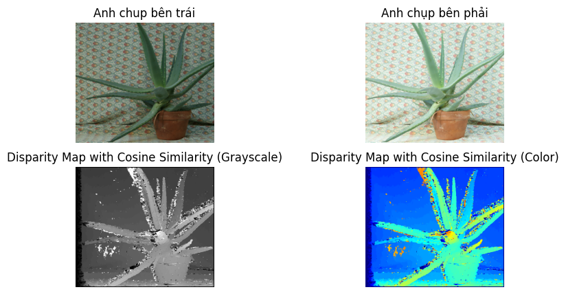

# Depth Image Estimation

## Project Description
This project uses Stereo Matching techniques to estimate the depth of an image from two input stereo images.

## System Requirements
- Python 3.11
- Python libraries: OpenCV, NumPy, Matplotlib, etc.

## Installation Guide
1. Clone the repository:
    ```bash
    git clone https://github.com/NguyenHuy190303/Image-Depth-Estimation.git
    cd Image-Depth-Estimation
    ```

2. Install the required libraries:
    ```bash
    pip install -r requirements.txt
    ```
2. Run app:
    ```bash
    streamlit run app.py
    ```
## Usage Guide
1. Run the `Stereo Matching.ipynb` script in Jupyter Notebook or Jupyter Lab.
2. Ensure you have two stereo images as input.

## Illustrative Images
Below are some illustrative images of the project's results:

### Input Images


### Estimated Depth Image



